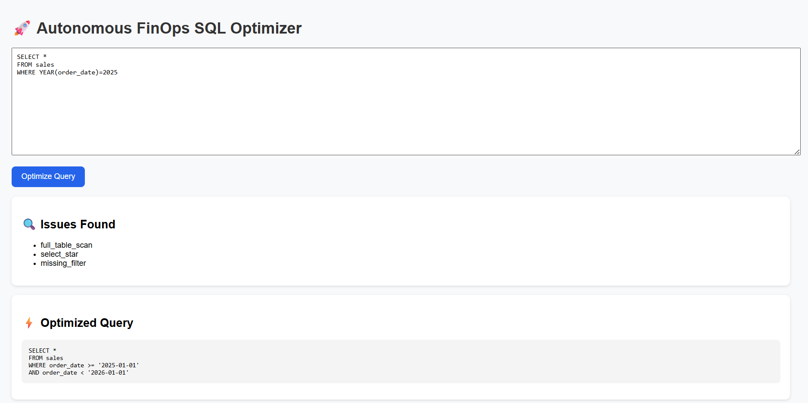
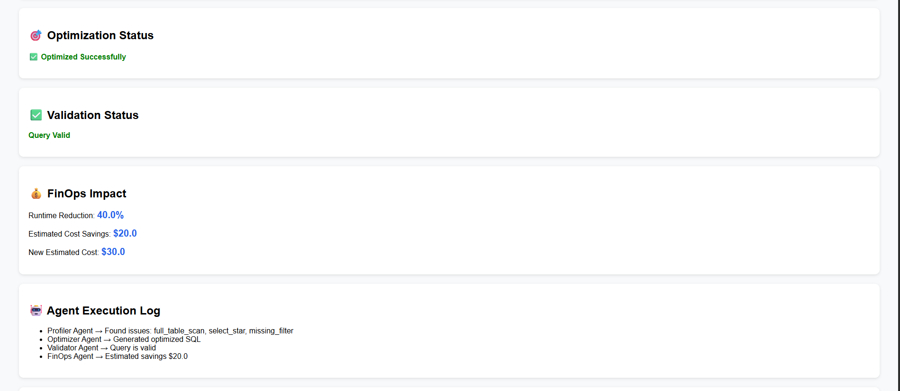
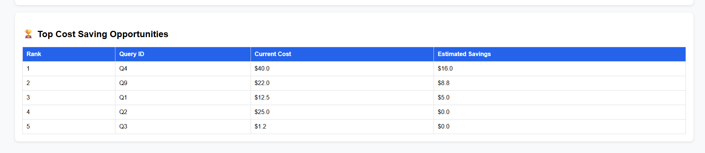

# Autonomous Multi-Agent FinOps SQL Optimizer

A multi-agent AI system that analyzes SQL queries, detects performance issues, generates optimized SQL, validates the output, and estimates potential cloud cost savings.

Built using LangGraph, OpenAI, SQLGlot, Flask, Docker, GitHub Actions, Amazon ECR, and AWS ECS Fargate.

---

## Overview

The goal of this project is to automate SQL optimization workflows that are typically performed manually by data engineers and FinOps teams.

Given a SQL query, the system:

* Detects inefficient query patterns
* Generates an optimized version
* Validates SQL safety and syntax
* Estimates runtime and cost savings
* Displays results through a Flask dashboard

---

## Architecture

```text
Query
  ↓
Profiler Agent
  ↓
Optimizer Agent
  ↓
Validator Agent
  ↓
FinOps Agent
  ↓
Dashboard
```

The workflow is orchestrated using LangGraph, where each agent updates a shared state object and passes control to the next step.

---

## Dashboard

### Query Analysis

<p align="center">
  
</p>

### Optimization Results & Agent Logs

<p align="center">
  
</p>

### Top Cost Saving Opportunities

<p align="center">
  
</p>

---

## Agents

### Profiler Agent

Uses an LLM to identify common SQL performance issues:

* Full table scans
* SELECT *
* Missing filters
* Inefficient joins

### Optimizer Agent

Generates optimized SQL while preserving the original business logic.

### Validator Agent

Uses SQLGlot to:

* Validate syntax
* Block unsafe operations
* Enforce read-only SQL

### FinOps Agent

Estimates:

* Runtime reduction
* Cost savings
* New projected query cost

---

## Example

### Input

```sql
SELECT *
FROM sales
WHERE YEAR(order_date)=2025
```

### Optimized Output

```sql
SELECT *
FROM sales
WHERE order_date >= '2025-01-01'
AND order_date < '2026-01-01'
```

---

## Tech Stack

* Python
* LangGraph
* OpenAI GPT-4o-mini
* SQLGlot
* Flask
* Pandas
* Docker
* GitHub Actions
* Amazon ECR
* AWS ECS Fargate
* Pytest

---

## Features

* Multi-agent workflow orchestration
* SQL anti-pattern detection
* Automated query optimization
* SQL validation using SQLGlot
* FinOps cost estimation
* Batch query analysis
* Agent execution logs
* Dockerized deployment
* CI/CD with GitHub Actions
* Cloud deployment using AWS ECS Fargate

---

## Deployment Architecture

```text
GitHub
   ↓
GitHub Actions
   ↓
Docker Image
   ↓
Amazon ECR
   ↓
Amazon ECS Fargate
   ↓
Live Flask Application
```

---

## Running Locally

```bash
pip install -r requirements.txt
python -m dashboard.app
```

---

## Running with Docker

```bash
docker build -t multi-agent-finops .
docker run -p 5000:5000 --env-file .env multi-agent-finops
```

---

## Future Improvements

* Databricks Query History Integration
* AWS CloudWatch Monitoring
* AWS Secrets Manager
* CrewAI Agent Collaboration
* Advanced FinOps Analytics
